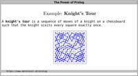

# The Power of Prolog

## Introduction to modern Prolog

Prolog is a **programming language** that is rooted in
formal&nbsp;logic. It supports *search* and *unification*
as built-in features. Prolog allows us to elegantly&nbsp;solve
many&nbsp;tasks with short and general programs.

[*A Tour of Prolog:*](https://www.metalevel.at/prolog/videos/tour) 

The goal of this material is to *bridge the&nbsp;gap* between the
great traditional Prolog textbooks of the&nbsp;past and the language
*as it currently is*, several decades after these books
were&nbsp;written. You will see that many limitations of the past are
no longer relevant, while several new constructs are now of great
importance even though they are not yet covered in any available
Prolog&nbsp;book.

## Reading this book

This book is *self-hosting*: It includes an HTTP&nbsp;server that lets
you browse most of the content locally. When you access files that are
*not* locally available, it redirects to their online&nbsp;versions.

You need [Scryer&nbsp;Prolog](https://github.com/mthom/scryer-prolog)
to run it. For example, to spawn the server on port&nbsp;6012, use:

    $ scryer-prolog -g "server(6012)" server.pl

Then, direct your browser to:

   http://localhost:6012/prolog

If you are new to Prolog, read the chapters in&nbsp;order for a
self-contained exposition of many important language features. If you
already have some experience with Prolog and would like to learn more
about more recent aspects, I recommend you start with the chapter on
[integer&nbsp;arithmetic](https://www.metalevel.at/prolog/clpz) and
proceed with the chapters it links&nbsp;to.

## About this book

The latest version of this book is always available from:

**https://www.metalevel.at/prolog**

I will periodically synch this repository with new material as it
becomes available.

I started writing this book in 2005, when I was a student of
Ulrich&nbsp;Neumerkel in Vienna. A collection of
[Prolog&nbsp;meta-interpreters](https://www.metalevel.at/acomip/)
formed the first chapter.

To run the code examples, you can use every Prolog implementation that
conforms to the Prolog ISO&nbsp;standard and provides the following
conforming extensions:

- Definite Clause Grammars (DCGs)
- constraints like `dif/2` and declarative integer arithmetic
- alternative execution strategies such as SLG&nbsp;resolution.

A *conforming* extension is a language feature that would not cause
any ambiguity or contradiction if it were added to the Prolog
standard, ISO/IEC&nbsp;13211. Notably, a conforming extension
*must&nbsp;not* change the meaning of Prolog text which conforms to
the standard. Each of the above features can be added to every
Prolog&nbsp;system in a conforming manner, as exemplified by the
following recommended Prolog&nbsp;systems:

- [SICStus Prolog](https://sicstus.sics.se/)
  A state-of-the-art, ISO standard compliant, Prolog system.
- [Scryer Prolog](https://www.scryer.pl)
  A modern Prolog implementation written mostly in Rust.
- [GNU Prolog](http://www.gprolog.org/)
  A free Prolog compiler with constraint solving over finite domains.

In the example code, I assume that the Prolog flag `double_quotes` is
set to the value&nbsp;`chars` so that strings in double-quotes are
interpreted as lists of *characters*. This was the case in the
original Prolog implementation, Marseille Prolog, and is already the
default value in the four newest Prolog implementations,
[Scryer&nbsp;Prolog](https://github.com/mthom/scryer-prolog),
[Tau&nbsp;Prolog](https://github.com/tau-prolog/tau-prolog),
[Trealla&nbsp;Prolog](https://github.com/trealla-prolog/trealla) and
[ichiban/prolog](https://github.com/ichiban/prolog). It is to be hoped
that other Prolog&nbsp;systems will also adopt this setting to make
string&nbsp;processing with Prolog more convenient.

In some cases, slight modifications to code snippets may be necessary
to adjust for different libraries or small variations. See your Prolog
system's manual, or ask on&nbsp;Stackoverflow and `comp.lang.prolog`
for more information.

## On teaching Prolog

Prolog is an interesting programming language: It has a *pure*
monotonic core, and it also has features that are
called&nbsp;*impure*. You, the programmer, must decide in which subset
of the language you want to program.

In a sense, programming in Prolog is like writing a&nbsp;poem: You can
achieve great effects by writing under stringent constraints.
In&nbsp;Prolog, you often get the best results by restricting
your&nbsp;work to the pure&nbsp;core of the&nbsp;language. As long as
you do this, you can benefit from strong logical properties which let
you reason about your programs in systematic ways that are not
available in most other programming&nbsp;languages.

In the past decades, many pure features have become widely available
in Prolog&nbsp;systems. This book explains many of these new features,
and shows you how you can use them to achieve general and efficient
Prolog&nbsp;programs.

Currently, new pioneers are arising: The first instructors who use
this&nbsp;book in their&nbsp;courses! For example:

- As of 2018, Norbert Zeh is using *The Power of Prolog* in
  [CSCI&nbsp;3136: Principles of Programming
  Languages](https://web.cs.dal.ca/~nzeh/Teaching/3136/index.html) at
  Dalhousie&nbsp;University in&nbsp;Canada.
- As of 2018, Andrej Bauer is using *The Power of Prolog* in his
  specialist elective course [Principles of Programming
  Languages](https://ucilnica.fri.uni-lj.si/course/view.php?id=67) at
  the University of Ljubljana in&nbsp;Slovenia.
- As of 2018, José A. Alonso Jiménez is using *The Power of Prolog* in
  his [Seminario de Lógica
  Computacional](https://www.glc.us.es/~jalonso/SLC2018/index.php/Documentaci%C3%B3n)
  at the Universidad de Sevilla in&nbsp;Spain.
- As of 2019, Adam Dingle is using *The Power of Prolog* in
  [Non-Procedural
  Programming](https://ksvi.mff.cuni.cz/~dingle/2019/npp/npp.html) at
  Univerzita&nbsp;Karlova in the Czech&nbsp;Republic.
- As of 2019, Dylan Schwesinger is using *The Power of Prolog* in
  [Artificial
  Intelligence&nbsp;II](http://csitrd.kutztown.edu/~schwesin/spring19/csc548/index.html)
  at Kutztown&nbsp;University in the United States of America.
- As of 2020, Andrea Schwertner Charão is using *The Power of Prolog* in
  [Paradigmas de Programação](https://github.com/AndreaInfUFSM/elc117-2020a/)
  at the Federal University of Santa Maria in Brazil.
- As of 2020, Alejandro Guerra Hernández is using *The Power of
  Prolog* in [Programación para la Inteligencia
  Artificial&nbsp;(PIA)](https://www.uv.mx/personal/aguerra/pia/) at
  the Universidad Veracruzana in Mexico.
- As of 2021, Ilkka Kokkarinen is using *The Power of Prolog* in
  [CCPS&nbsp;721 Artificial
  Intelligence&nbsp;I](https://github.com/ikokkari/AI) at the G.
  Raymond&nbsp;Chang School of Continuing&nbsp;Education,
  Ryerson&nbsp;University, in Canada.
- I hope you are next!

<pre>
Le message dur:
<b>Restez purs!</b>
</pre>
